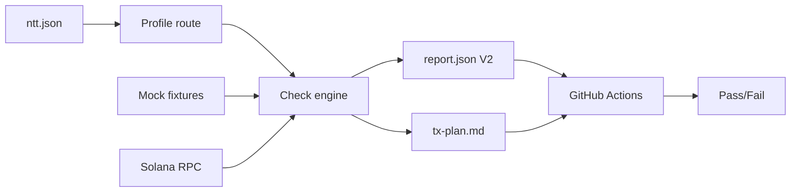

# Sunrise NTT Preflight
Sunrise-native CI guardrail for NTT deployments: catches misconfigured peers, decimal mismatches, and broken Executor paths before they hit production — in 30 seconds.

## 30-second demo
Run the deterministic mock-first narrative end-to-end:

```bash
bash scripts/demo-mock-flow.sh
```

Flow: broken -> verify -> plan -> fixed -> re-verify -> READY (deterministic/mock-first).

Real output snippet:
```text
STEP 3/4: Verify fixed mock fixture (expect READY-style green incl. CHK-012/013)
STEP 4/4: Demo summary
- Broken report: ./artifacts/demo-mock-flow/1-broken-verify/report.json
- Plan artifact: ./artifacts/demo-mock-flow/2-plan/tx-plan.md
- Fixed report: ./artifacts/demo-mock-flow/3-fixed-verify/report.json
READY: mock narrative succeeded (broken -> plan -> fixed).
```

## What it checks (high-level)
- Config intent readiness and parseability.
- NTT manager and peer mapping config invariants.
- Peer registration symmetry across directions.
- Directional decimals mismatch detection.
- Executor endpoint reachability and relay capabilities shape.
- Executor transceiver config presence and quote payload sanity.
- Static compute-budget sanity vs documented threshold.

## Checks matrix
| CHK-ID | Name | What it catches | Mode |
|---|---|---|---|
| CHK-001 | config-intent-source-readiness | Missing/unreadable/unparseable config source | config |
| CHK-002 | solana-rpc-health-readiness | Solana RPC unavailable/unhealthy for reads | rpc |
| CHK-003 | ntt-intent-manager-program-id-invariant | Invalid/missing manager.solanaProgramId intent | config |
| CHK-004 | ntt-peer-chain-mapping-presence | Missing/empty peer mapping | config |
| CHK-005 | ntt-peer-mapping-entry-value-shape | Invalid peer value shape | config |
| CHK-006 | ntt-peer-mapping-key-shape | Invalid peer key shape | config |
| CHK-007 | peer-registration-symmetry-mock | One-way peer registration (asymmetry) | mock+routed-rpc |
| CHK-008 | decimals-sync-mock | Directional decimals mismatch | mock+routed-rpc |
| CHK-009 | executor-endpoint-reachability | Executor endpoint not reachable under minimal policy | mock+real-http |
| CHK-010 | executor-relay-capabilities | Invalid/missing capabilities payload shape | mock+real-http |
| CHK-011 | executor-transceiver-config-presence | Missing executor transceiver config reference | config |
| CHK-012 | executor-quote-sanity | Invalid quote payload JSON/shape | mock+real-dry-run |
| CHK-013 | compute-budget-sanity | Configured gasLimit below static threshold | static-config |

## How it works
- Runtime model is strict: `PASS` / `FAIL` / `SKIPPED` only.
- Engine runs deterministic-first and supports mock-first execution.
- Tooling is read-only: no tx signing, no tx sending, no key handling.
- `plan` is FAIL-driven remediation text (key mappings include executor checks, incl. CHK-012).
- Profiles: `ntt-generic` and `sunrise-executor`.

## Architecture


## CI
GitHub Actions runs on `push` and `pull_request`.
Workflow executes `npm ci` + `bash scripts/demo-mock-flow.sh`.
Pipeline is deterministic and does not require secrets/env vars.

## Limitations / Non-goals
- No transaction execution or signing.
- No deep quote semantics or pricing correctness (sanity only).
- CHK-011 validates config presence only, not on-chain registration state.
- Demo and CI are mock-first and do not require network/secrets.
- Chain-aware/deep validations are out of scope where explicitly not implemented.
